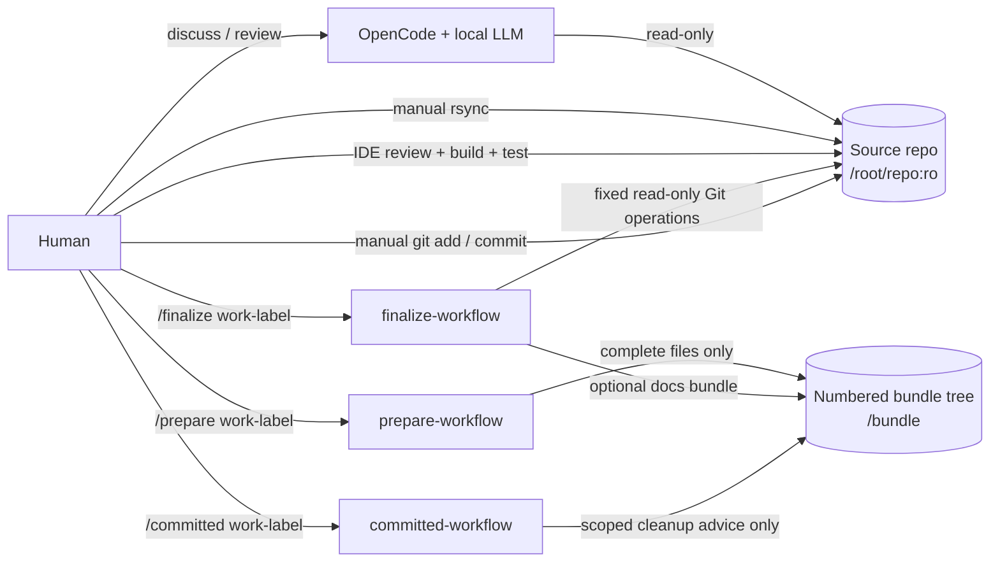

# Controlled OpenCode Workflow

Copyright © 2026 Alai Engineering

A safety-first, human-controlled workflow for using OpenCode with a local LLM on an existing source repository.

The design deliberately separates **understanding code** from **changing code**:

- the real repository is mounted read-only;
- normal chat can inspect source but cannot create changes or inspect Git state;
- `/prepare` may write only to an external numbered bundle tree;
- bundles contain complete files, not patches;
- the human applies bundles, reviews Git changes, builds, tests, stages, commits, and pushes;
- `/finalize` gets narrow read-only Git inspection plus optional documentation-bundle authority;
- `/committed` can report only the scoped post-commit cleanup command.

> **Independent project:** this repository is not built by, endorsed by, or affiliated with the OpenCode team. OpenCode itself is available at <https://github.com/anomalyco/opencode>.

## Why this exists

Most coding-agent setups optimize for autonomy. This one optimizes for a different goal: **give the model broad read access for engineering reasoning while keeping mutation authority narrow, explicit, and reversible**.

OpenCode's permission rules are useful policy controls, but they are not treated as the security boundary here. The source repository is also protected by a Docker read-only bind mount. The model can propose changes, but it cannot directly write them into the real working tree.

## Architecture



## Authority model

| Mode | Read repo | Git inspect | Write bundle | Shell/edit repo | Intended use |
|---|---:|---:|---:|---:|---|
| normal `controlled` chat | yes | no | no | no | design, review, debugging discussion |
| `/prepare` | yes | no | yes | no | create one immutable implementation bundle |
| `/finalize` | yes | fixed read-only operations | docs bundle only if needed | no | review tested state and produce commit guidance |
| `/committed` | yes | fixed read-only operations | cleanup info only | no | verify commit and print scoped cleanup command |

The source repository remains mounted `:ro` in every mode.

## Bundle lifecycle

```text
DISCUSS
  ↓
/prepare <work-label>
  ↓
bundle 001
  ↓
human rsync → IDE review → build/test
  ↓
failure → discuss → /prepare same-label → bundle 002 → repeat
  ↓
success
  ↓
/finalize same-label
  ↓
optional NNN-final documentation bundle
+ implementation summary
+ explicit git add -- <specific files>
+ git commit guidance
  ↓
human applies/reviews docs and commits
  ↓
/committed same-label
  ↓
post-commit verification + scoped cleanup command
```

A completed bundle is immutable. Corrections always create the next number.

Example:

```text
/bundle/
  mapping-memory/
    001/
      files/
        backend/src/...
      metadata.json
      manifest.md
    002/
      ...
    003-final/
      ...
```

Apply a bundle manually with the command recorded in its manifest:

```bash
rsync -av -- '/path/to/opencode-bundles/mapping-memory/001/files/' '/path/to/repository/'
```

Never add `--delete`. Deletions and rename-source removals are intentionally recorded for separate manual review.

## Safety controls

The controls are intentionally layered:

1. **Physical source protection** — `${REPO_PATH}` is mounted at `/root/repo:ro`.
2. **Read-only container root filesystem** — only explicit state/config/bundle mounts and `/tmp` are writable.
3. **Normal-chat least privilege** — bundle tools and Git inspection are denied in the primary `controlled` agent.
4. **Command-scoped authority** — hidden `/prepare`, `/finalize`, and `/committed` agents receive only the custom tools needed for that phase.
5. **No arbitrary shell** — built-in Bash, edit, LSP, web, and general task/subagent authority are denied.
6. **Narrow Git tool** — `git_inspect` accepts only `status`, `name_status`, `diff`, and `recent_log`; it accepts no command string or arbitrary arguments.
7. **Path-safe bundle tool** — bundle paths reject absolute paths, `..`, and `.git`.
8. **Immutable bundles** — completed bundles cannot be changed; a correction requires a new numbered bundle.
9. **Human validation boundary** — the human performs rsync, IDE review, builds, tests, staging, commit, push, and deletion.

The model can still generate incorrect code. This project constrains **authority**, not correctness.

## Prerequisites

- Docker Engine with Docker Compose
- a repository on the host to inspect
- an OpenAI-compatible LLM endpoint reachable from the OpenCode container
- `rsync` on the host for applying bundles

The included local-model defaults were validated with Qwen 3.5 at a 65,536-token context window and a 4,096-token output limit. Those numbers are configuration defaults, not universal requirements; keep them aligned with the limits of your model server.

This repository's plugin dependency is pinned to `@opencode-ai/plugin` `1.18.16`, matching the OpenCode version used during validation. If you move to another OpenCode release, keep the plugin dependency compatible with it.

## Setup

### 1. Configure the environment

```bash
cp .env.example .env
```

Edit `.env`:

```text
REPO_PATH=/absolute/path/to/your/repository
BUNDLE_ROOT=/absolute/path/to/opencode-bundles
HOST_GID=<output of id -g>
QWEN_BASE_URL=<OpenAI-compatible /v1 endpoint reachable from the container>
QWEN_MODEL_ID=<served model ID>
OPENCODE_SERVER_PASSWORD=<long random password>
```

The Web UI is bound to `127.0.0.1`, not directly exposed to the LAN.

### 2. Prepare the bundle root

```bash
mkdir -p /absolute/path/to/opencode-bundles
chgrp "$(id -gn)" /absolute/path/to/opencode-bundles
chmod 2775 /absolute/path/to/opencode-bundles
```

If the directory is not owned by your account, use the appropriate elevated permissions for the one-time `chgrp`/`chmod` operation.

### 3. Build and start OpenCode

```bash
docker compose up --build -d
```

The custom tools import `@opencode-ai/plugin`. Install the pinned dependency into the writable OpenCode config mount:

```bash
docker compose exec opencode sh -lc '
npm_config_cache=/tmp/npm-cache \
npm install \
  --prefix /root/.config/opencode \
  --omit=dev \
  --no-audit \
  --no-fund \
  --package-lock=false
'
```

Then restart once so the complete configuration is loaded cleanly:

```bash
docker compose restart opencode
```

### 4. Verify the server

```bash
curl -fsS -u 'opencode:<your-password>' http://127.0.0.1:4096/global/health
```

If your OpenCode version exposes health at a different endpoint, use its corresponding server health endpoint.

You can inspect the loaded provider model limits with:

```bash
curl -fsS -u 'opencode:<your-password>' http://127.0.0.1:4096/provider | jq
```

## Using the workflow

### Discuss

Use ordinary chat for architecture, code review, debugging, and design. Normal chat may read the repository but cannot create a bundle. Even messages such as `proceed` or `implement it` do not grant mutation authority.

### Prepare

When the design is ready:

```text
/prepare mapping-memory
```

The hidden prepare agent re-reads the **current** repository and creates exactly one new complete-file bundle. The current filesystem is authoritative; earlier bundles are never assumed to have been fully applied.

### Review, apply, build, and test

Apply the bundle manually using the manifest's `rsync -av` command. Then review the real Git changes in your IDE and run builds/tests yourself.

If something fails, discuss the evidence first. When another bundle is actually desired:

```text
/prepare mapping-memory
```

That creates `002`, not an overwrite of `001`.

### Finalize

After the implementation has passed your tests:

```text
/finalize mapping-memory
```

Finalization may inspect Git only through the fixed `git_inspect` operations. It can generate a final documentation bundle only when documentation is materially affected, and it returns explicit staging and commit guidance. It never stages or commits.

### Committed

After the human commit succeeds:

```text
/committed mapping-memory
```

This phase verifies post-commit status/history through the fixed Git tool and prints a cleanup command scoped to that work label, for example:

```bash
rm -rf -- '/absolute/path/to/opencode-bundles/mapping-memory'
```

It never runs the cleanup itself.

## Why `/root/repo`?

OpenCode Web's project picker naturally operates beneath the container user's home directory. Mounting the source at `/root/repo` keeps it easy to select while preserving the Docker `:ro` enforcement boundary.

## Why is `./config` writable?

OpenCode creates config-side runtime/package files such as a `.gitignore`, and the custom tools need their plugin dependency available under that configuration tree. The config bind mount is therefore writable and is covered by this repository's `.gitignore`.

That does **not** make the source repository writable: `/root/repo` is a separate bind mount with Docker's read-only flag.

## Tested baseline

The workflow was exercised with:

- OpenCode `1.18.16`
- a local Qwen 3.5 endpoint using the OpenAI-compatible API
- OpenCode model metadata: `context=65536`, `output=4096`
- source repository mounted read-only at `/root/repo`
- bundle output mounted read-write at `/bundle`
- container UID `0` with the host user's primary GID
- all Linux capabilities dropped except `DAC_OVERRIDE`

A repository-scale read-only review completed at 64K without forced compaction, while smaller 32K limits were insufficient for that particular multi-file workload. Treat this as an observed baseline, not a claim that every repository or model needs 64K.

## Repository contents

```text
.
├── .dockerignore
├── .env.example
├── .gitignore
├── Dockerfile
├── README.md
├── compose.yaml
└── config/
    ├── opencode.json
    ├── package.json
    ├── agents/
    │   ├── committed-workflow.md
    │   ├── controlled.md
    │   ├── finalize-workflow.md
    │   └── prepare-workflow.md
    ├── commands/
    │   ├── committed.md
    │   ├── finalize.md
    │   └── prepare.md
    └── tools/
        ├── bundle.js
        └── git_inspect.js
```

## Non-goals

This repository intentionally does not:

- let the model edit the real source tree;
- let the model run builds/tests/formatters/package managers;
- let the model stage, commit, or push;
- apply patches automatically;
- clean bundle history automatically;
- promise that generated code is correct.

The point is not maximum autonomy. The point is useful local-model assistance with explicit, reviewable handoffs back to the human.
